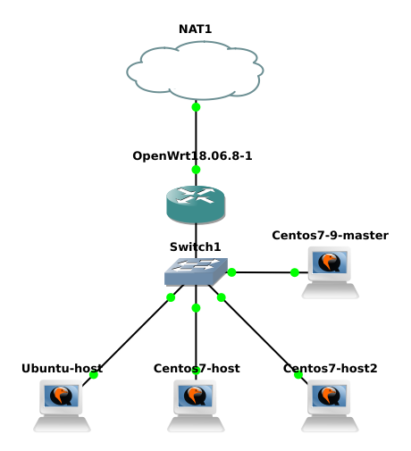

# CondorDumbProject

Программа для проверки чисел на простоту, предназначенная для работы в кластере HTCondor.

## Схема кластера.

Для построения кластера было выбрано следующее расположение компьютеров в локальной сети



Для построения выше представленной схемы была использована программа gns3.

На схеме указанно пять хостов. Непосредственно в вычислениях участвуют три компьютера. Два оставшихся хоста выполняю функции управления кластером.

Компьютеры с именами Ubuntu-host, Ubuntu-host1 и Centos7-host выполняют роль исполнителя (Execute). Компьютер Centos7-9-master выполняет роль центрального менеджера (Central Manager). А компьютер Centos7-submit отправителем (Submit).

## Конфигурация Centos7-9-master 

Первым делом установим HTCondor на *Centos7-9-master*.

Данный компьютер выполняет роль менеджера. Следующая команда установит HTCondor с данными параметрами.


```
htcondor_password=password
central_manager_name=192.168.1.243  #  адресс Centos7-9-master
sudo curl -fsSL https://get.htcondor.com | GET_HTCONDOR_PASSWORD=$htcondor_password /bin/bash -s -- --no-dry-run --central-manager  $central_manager_name
```

Проверим работу менеджера командой, которая отобразить информацию о состоянии хостов:

```
condor_status
```

Отключаем фаервол:
```
sudo systemctl stop firewalld.service 
```

И надо ещё включить сервис condor на автозагрузку:

```
sudo systemctl enable condor.service
```

## Установка Ubuntu-host

```
htcondor_password=password
central_manager_name=192.168.1.243
sudo curl -fsSL https://get.htcondor.com | GET_HTCONDOR_PASSWORD=$htcondor_password /bin/bash -s -- --no-dry-run  --execute $central_manager_name
```

## Установка Centos7-host

```
htcondor_password=password
central_manager_name=192.168.1.243
sudo curl -fsSL https://get.htcondor.com | GET_HTCONDOR_PASSWORD=$htcondor_password /bin/bash -s -- --no-dry-run --execute $central_manager_name
```

## Установка Centos7-host2

Данный хост ответственный за отправку заданий.

```
htcondor_password=password
central_manager_name=192.168.1.243
sudo curl -fsSL https://get.htcondor.com | GET_HTCONDOR_PASSWORD=$htcondor_password /bin/bash -s -- --no-dry-run --submit $central_manager_name
```

Проверим его работу командный, которая показывает количество заданий:

```
condor_q
```

## Проверка работоспособности кластера HTCondor

Теперь перейдём на хост *Centos7-host2* и создадим файл `sleep.sh`:

```
#!/bin/bash

TIMETOWAIT="6"
echo "sleeping for $TIMETOWAIT seconds"
/bin/sleep $TIMETOWAIT
```

Теперь сделаем скрипт исполняемым:

```
chmod u+x sleep.sh
```

Теперь создаём вспомогательный файл `sleep.sub`.

```
# sleep.sub -- simple sleep job

executable              = sleep.sh
log                     = sleep.log
output                  = outfile.txt
error                   = errors.txt
should_transfer_files   = Yes
when_to_transfer_output = ON_EXIT
queue
```

Чтобы запустить скрипт в пуле, выполните команду:

```
condor_submit sleep.sub
```

Мониторить выполнение задачи можно командой:

```
condor_q
```

После завершения работы в каталоге появляются следующие файлы:

* outfile.txt — вывод программы
* errors.txt — сюда идут ошибки
* sleep.log — логи выполнения

В случае, если работа *повисал*, то её можно удалить командой:

```
condor_rm 6
```

В вышеописанной команде необходимо вместо **6** указать номер работы.

## Алгоритм нахождение положительных совершенных чисел

> **Совершенное число** — натуральное число, равное сумме всех своих собственных делителей.

Алгоритм нахождения положительных совершенных чисел строится на *тесте Люка — Лемера*, который является тестом на простоту для чисел Мерсенна.

Алгоритм поиска состоит в переборе чисел. Число *𝑝*, которое было выбрано на данной итерации перебора подставляется в формуле числа Мерсенна *2^𝑝 − 1*. Получившееся число Мерсенна проверяется на простоту тестом Люка — Лемера. Если число простое, то вычисляем совершенное формуле *2^(𝑝−1)(2^𝑝 − 1)*. Далее переходим к следующей итерации числа *𝑝*.

## Описание работы программы

Программа получает число через аргумент из командной строки. Из полученного числа вычисляется число Мерсенна, которе проверяется на простоту. 

Если число Мерсенна простое, то из него вычисляется совершенное число, которое выводится  пользователю.

## Приложение

Теперь запустим в condor приложение с параметрами.

Для запуска программы требуется установить gcc 10 версии.

Поместите репозиторий с программой на виртуальную машину *Centos7-submit*.

Соберём программу и сделаем бинарный файл исполняемым:

```
gcc -lgmp -lm -o server main.c
chmod u+x server
```

Теперь создадим server.sub:

```
executable              = server
arguments               = $(X)
log                     = server.log
output                  = $(X).out
error                   = errors.txt
should_transfer_files   = Yes
when_to_transfer_output = ON_EXIT
queue

```

Переменную *𝑋* которую мы используем, можно передать при запуске.

Теперь запустим задачу:

```
condor_submit  X=3 server.sub
```

Данная задача отправит свободному компьютеру кластера выполнить программу `server` с аргументом "3".

Если воспользоваться возможностями bash, можно создать произвольное количество заданий.

```
for (( i=1; i<100; i++)) do condor_submit X=$i server.sub; done
```

После завершения всех заданий, в директории появились 99 файлов выводов с расширением .out. Для того, чтобы вывести все результаты достаточно воспользоваться командой `cat *.out`, которая выведет все команды с расширением .out. Но надо заметить, что данная команда будет выводит файлы без сортировки. Чтобы сформировать в выводе возрастающую последовательность совершенных числе, необходимо перенаправить вывод в команду sort. 

Итоговая команда будет выглядеть как `cat *.out | sort -n`.

```
1
6
28
496
8128
33550336
8589869056
137438691328
2305843008139952128
2658455991569831744654692615953842176
191561942608236107294793378084303638130997321548169216
```

## Деинсталляция

Для удаления conder в centos используется следующая команда:

```
sudo yum -y autoremove condor && sudo rm -fr /etc/condor
```

А для Ubuntu:

```
sudo apt-get -y remove --purge htcondor && sudo apt-get -y autoremove --purge && sudo rm -fr /etc/condor
```
